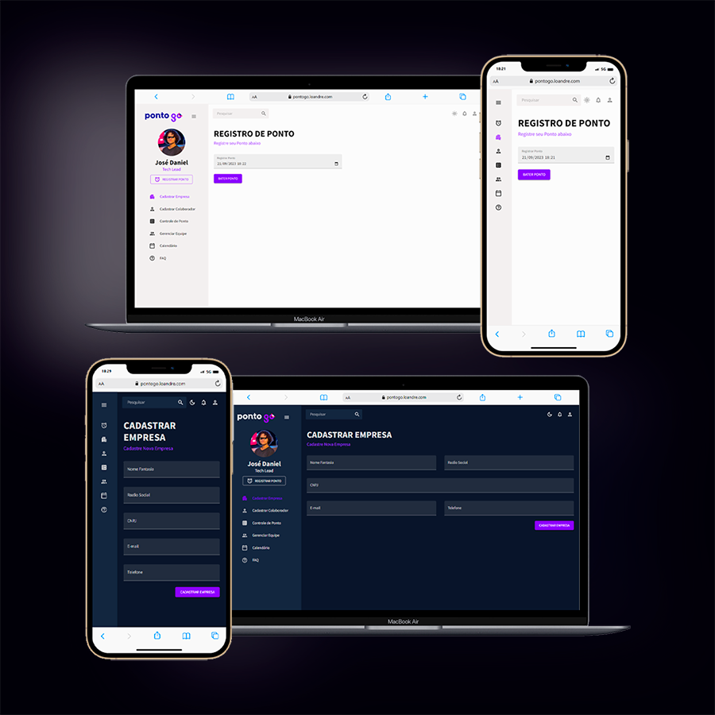

# Desafio Técnico - Interface de Ponto Eletrônico

<p></p>

## 🔗 **Confira o Resultado** [clicando aqui.](https://pontogo.loandre.com/)

Este projeto foi concebido como uma resposta ao desafio proposto pela empresa Ponto Go. O objetivo principal é desenvolver uma interface eficiente e user-friendly que possa interagir de forma adequada com a API fornecida pela empresa, permitindo o registro adequado de empresas, colaboradores e seus respectivos pontos.

## 📋 Roteiro do Desafio

- **Criar uma interface e conectá-la com a API fornecida:**
  - Consumir a API fornecida pela empresa para realizar as operações necessárias.

- **Construir a aplicação utilizando React:**
  - Desenvolver páginas separadas para cada funcionalidade exigida.

- **Desenvolver as seguintes páginas:**
  - Formulário de cadastro da empresa: Consumindo a API (Register New Company / Company).
  - Formulário de cadastro do colaborador: Consumindo a API (Register New Employees / Employees).
  - Botão para efetuar o ponto do colaborador específico: (Add Point / Point).
  - Lista mostrando os pontos registrados do colaborador específico: (Get Points of a Day / Point).

## 🛠️ Tecnologias Utilizadas
- **React**: Biblioteca JavaScript para construir interfaces de usuário.
- **Material UI**: Biblioteca de componentes React para um desenvolvimento mais rápido e fácil.
- **Data Grid**: Componente para visualização de grandes conjuntos de dados tabulares.
- **Formik**: Biblioteca para a criação de formulários em React.
- **Yup**: Biblioteca JavaScript para validação de dados.
- **FullCalendar**: Biblioteca para a criação de calendários interativos.

## 🚀 Funcionalidades
1. **Cadastro de Empresas**: Possibilita o registro de novas empresas.
2. **Cadastro de Colaboradores**: Permite o registro de novos colaboradores.
3. **Registro de Ponto**: Oferece um botão para efetuar o ponto do colaborador específico.
4. **Visualização de Pontos**: Mostra os pontos registrados de um colaborador específico em uma lista.
5. **Calendário**: Funcionalidade extra desenvolvida para aprimorar a experiência do usuário.
6. **Gerenciar Equipe**: Desenvolvida para complementar e expandir o escopo do projeto.
7. **FAQ**: Criada para auxiliar usuários com dúvidas frequentes.

> **Nota**: As funcionalidades de Calendário, Gerenciar Equipe e FAQ foram implementadas para agregar mais valor ao projeto e proporcionar uma experiência mais completa ao usuário, mesmo não sendo requisitos originais do desafio.


## 🖥️ Vídeo mostrando a interface do Projeto

https://github.com/loandre/pontogo/assets/135539245/8b59a03c-be83-46ae-9498-92aa993281a4


# 💻 Como Executar o Projeto

Para executar o projeto localmente, siga os passos abaixo:

1. **Clone o repositório para sua máquina local:**

    ```sh
   git clone https://github.com/loandre/pontogo.git
   
3. **Navegue até o diretório do projeto:**
	
 	```cd
 	[Nome do Projeto]
 
4. **Instale as dependências necessárias:**
	
 	```sh
 	npm install
 
5. **Execute o projeto:**
	
 	```sh
 	npm start

# 🌟 Agradecimentos
Agradeço ao professor Daniel, que autorizou eu realizar este desafio. Sua orientação e apoio foram indispensáveis para a realização deste projeto. Agradeço também à empresa Ponto Go pela oportunidade de realizar este desafio.
